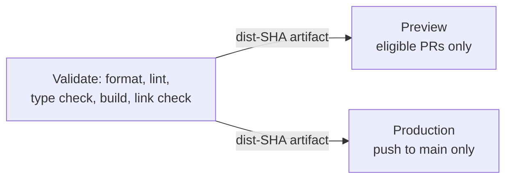

# Architecture

## Overview

The site is an Astro static application: every route is prerendered
to HTML at build time, and the resulting static output is served
as-is by Cloudflare Workers Static Assets. There is no server
rendering, no API layer, no database, and no runtime Worker
application code.

## Repository structure

```
src/
  pages/
    index.astro            Home
    about/index.astro      About
    projects/index.astro   Project list
    projects/[slug].astro  Project detail (from the projects collection)
    experience/index.astro Experience list
  layouts/
    BaseLayout.astro        Shared <head>/meta/JSON-LD/header/footer
  components/
    SiteHeader.astro
    SiteFooter.astro
  content/
    projects/                Project entries (Content Collection)
    experience/               Experience entries (Content Collection)
  content.config.ts          Content Collection schemas
  config/
    site.ts                  Central site configuration (name, nav, links)
  lib/
    projects.ts               Project collection helpers
  styles/
    global.css                Tailwind entry point
public/
  _headers                   Cloudflare security headers / CSP
  robots.txt
```

## Static architecture

`astro.config.mjs` sets `output: "static"`. There is no SSR adapter,
no server islands, no API routes, and no `main` entry in
`wrangler.jsonc` — the deployed Worker is an assets-only Worker with
no runtime application code. `trailingSlash: "always"` and
`build.format: "directory"` govern URL/output shape;
`build.inlineStylesheets: "never"` keeps all CSS as linked
stylesheets rather than inlined `<style>` blocks, which is also what
allows the CSP's `style-src` to be scoped to `'self'` (see
[Security model](#security-model)).

## Why Astro

The site is content-driven and has no interactivity requirement that
justifies a client-side framework. Astro produces static HTML with
zero shipped JavaScript by default, which matches the project's
static-first constraint directly rather than requiring one to be
retrofitted onto a more general-purpose framework.

## Why static generation

There is no requirement for personalization, authentication, or
data that changes per-request. Every page can be fully determined at
build time, which removes an entire class of runtime infrastructure
(server process, database, session handling) that a portfolio site
has no use for.

## Why Content Collections

Projects and experience entries are structured, repeated content with
predictable fields (title, dates, tags, ordering). Astro Content
Collections give this content a typed, validated schema (via Zod) and
compile-time checking, instead of hand-written frontmatter with no
validation.

## Styling and toolchain

Tailwind CSS 4 is integrated through `@tailwindcss/vite` (the Vite
plugin), not the older `@astrojs/tailwind` integration — there is no
`tailwind.config.js`; Tailwind 4 is configured via CSS
(`src/styles/global.css`) and the Vite plugin directly. TypeScript,
ESLint (`eslint-plugin-astro`, `typescript-eslint`), and Prettier
(`prettier-plugin-astro`, `prettier-plugin-tailwindcss`) run as the
quality gates described in [CI/CD](#cicd-architecture).

## Cloudflare Workers Static Assets

The build output (`dist/`) is deployed directly as static assets on a
Cloudflare Worker, with no Worker script (`wrangler.jsonc` has no
`main` field). This was chosen over introducing a runtime Worker
because nothing in the site requires one — request-time logic,
redirects, or transformations are not part of the current
requirements. A Worker runtime is not introduced merely to make the
project appear more complex; see [DEPLOYMENT.md](DEPLOYMENT.md) for
the deployment mechanics.

## CI/CD architecture

The workflow (`.github/workflows/ci.yml`) builds the site exactly
once per commit and reuses that same artifact for every deploy target
in the same run — nothing is rebuilt between Validate, Preview, and
Production:



Preview deploys a new Cloudflare Worker version and Version Preview URL
without shifting any production traffic. Production uploads a new
version from the same validated artifact and then explicitly promotes
it to 100% of production traffic — there is no gradual rollout. See
[DEPLOYMENT.md](DEPLOYMENT.md) for the full per-job breakdown and
operational detail.

## Security model

`public/_headers` defines the site's security headers, derived from
what the build actually contains rather than a generic template:

- `script-src 'none'` — there is no executable JavaScript anywhere in
  the build. The single `application/ld+json` block (homepage
  Person schema) is exempt from `script-src` under the HTML Living
  Standard's script-classification rules, since it is treated as
  non-executable data rather than a script for CSP purposes.
- `style-src 'self'` — all CSS is same-origin linked stylesheets
  (`inlineStylesheets: "never"`); there are no inline `style`
  attributes or `<style>` blocks.
- `img-src 'self'` — the build ships same-origin images (portrait
  placeholder, tool logos, project figures, background texture); no
  remote image source is permitted.
- `font-src 'none'` — the current build ships no custom fonts. This
  directive must be revisited in the same change that introduces one.
- `frame-ancestors 'none'` plus `X-Frame-Options: DENY` — the CSP
  directive is the primary anti-framing mechanism; the header is
  defense-in-depth for browsers that predate `frame-ancestors`.
- `X-Robots-Tag: noindex` is scoped only to `*.workers.dev` preview
  hosts, not the site root, so it never affects production/custom
  domain indexing.
- HSTS is intentionally not yet set — it is deferred until a
  deliberate, separately reviewed enablement decision (see
  [DEPLOYMENT.md](DEPLOYMENT.md)).

## Dependency maintenance

`.github/dependabot.yml` runs weekly (Mondays) for both the `npm`
ecosystem and `github-actions`. npm minor/patch updates are grouped
into a single PR; major version updates are always opened
individually so they can be reviewed for breaking changes. Every
Dependabot PR goes through the same `Validate` gate as any other PR.
Dependabot vulnerability alerts and security updates are enabled as a
repository setting (not represented in `dependabot.yml` itself).

## Content model

Content is modeled as Markdown files under `src/content/`, validated
against Zod schemas defined in `src/content.config.ts`.

**Projects** (`src/content/projects/*.md`):

| Field         | Type                | Notes                             |
| ------------- | ------------------- | --------------------------------- |
| `title`       | `string`            | required                          |
| `description` | `string`            | required                          |
| `year`        | `number` (int)      | required                          |
| `tags`        | `string[]`          | defaults to `[]`                  |
| `githubUrl`   | `url`               | optional                          |
| `liveUrl`     | `url`               | optional                          |
| `featured`    | `boolean`           | defaults to `false`               |
| `order`       | `number` (int, ≥ 0) | required — controls display order |

**Experience** (`src/content/experience/*.md`):

| Field       | Type                | Notes                                    |
| ----------- | ------------------- | ---------------------------------------- |
| `company`   | `string`            | required                                 |
| `role`      | `string`            | required                                 |
| `startYear` | `number` (int)      | required                                 |
| `endYear`   | `number` (int)      | optional — omitted means current/ongoing |
| `order`     | `number` (int, ≥ 0) | required — controls display order        |
| `tags`      | `string[]`          | defaults to `[]`                         |

Employment dates are published at year precision: the schema stores
years as integers rather than a more precise value the site would
immediately discard when rendering.

## Trade-offs

- The site cannot handle contact forms, dynamic personalization, or
  any request-time logic without introducing a runtime Worker — this
  is a deliberate constraint, not an oversight.
- `font-src 'none'` and the absence of HSTS reflect the current build
  and deployment state; `font-src` is expected to change if the site
  ever adds a custom font, and HSTS enablement is a deliberate,
  separately reviewed decision rather than an oversight.
